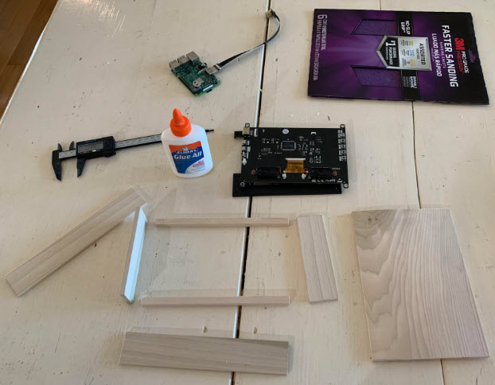
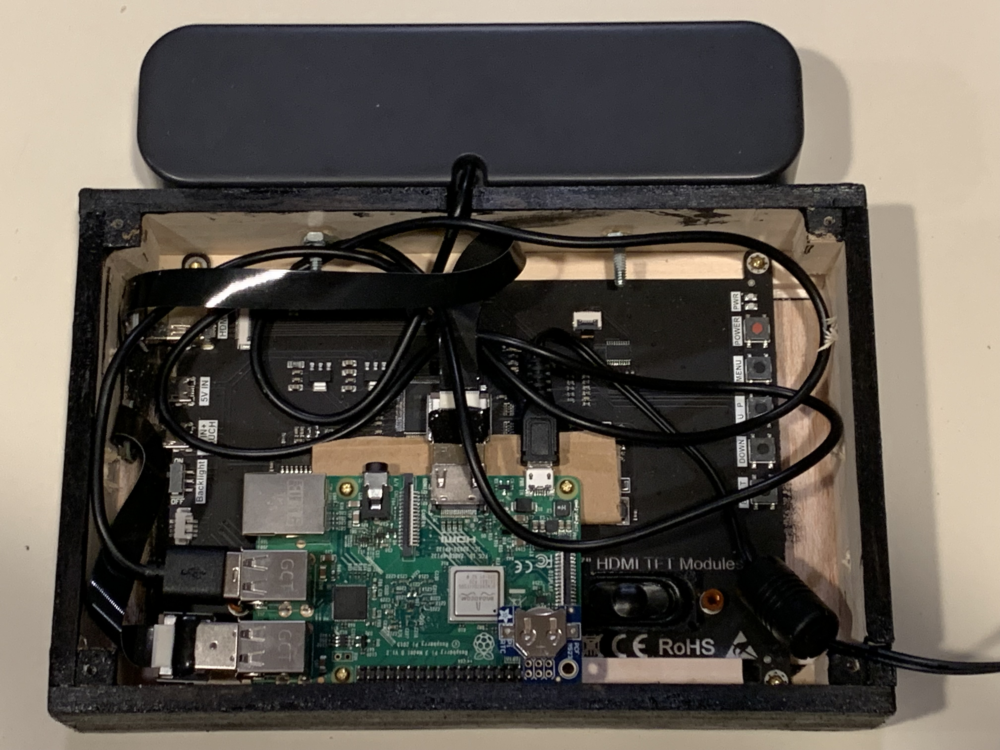
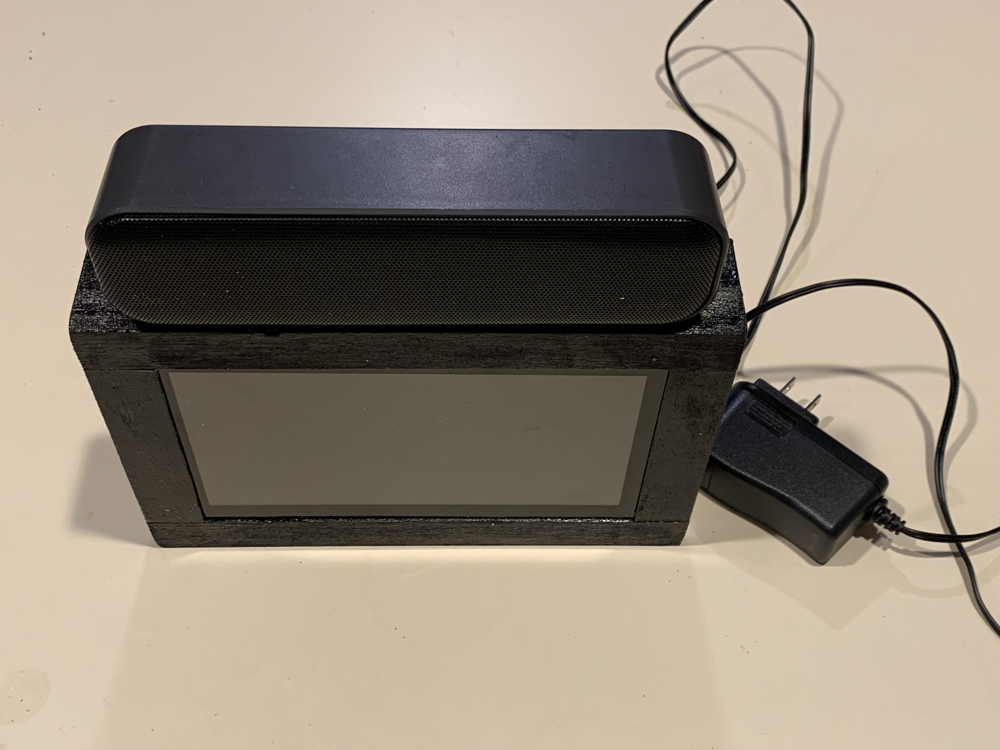
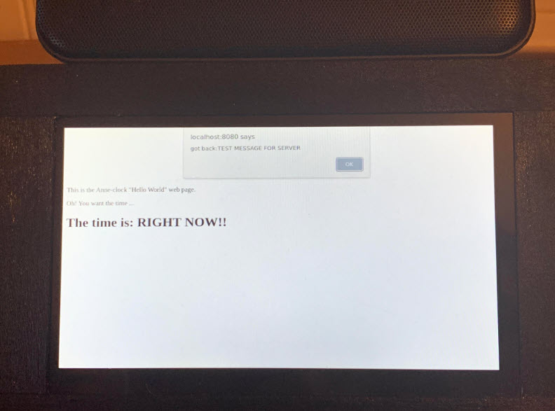

# anne-clock
The awesome Anne Clock








# The Display

https://www.amazon.com/dp/B08KXXKPW9

https://www.amazon.com/dp/B071WC4SXP

Hacked USB cable for the 4-pin USB connector on the back of the display.

USB wire colors:
* RED: 5V
* Bare: GND
* White: D-
* Greent: D+

# USB Sound Bar

https://www.amazon.com/dp/B07VJ3L588

Here is how to disable the pi onboard audio and activate the external USB sound card:

https://raspberrypi.stackexchange.com/questions/80072/how-can-i-use-an-external-usb-sound-card-and-set-it-as-default

# RTC For Pi

https://www.amazon.com/gp/product/B072DWKDW9

Needs CR1220 coin cell

Setup:

https://learn.adafruit.com/adding-a-real-time-clock-to-raspberry-pi/set-up-and-test-i2c

# Chrome Kiosk

https://www.raspberrypi.com/tutorials/how-to-use-a-raspberry-pi-in-kiosk-mode/

```
sudo apt update
sudo apt full-upgrade
sudo reboot

sudo raspi-config
```

Set boot to GUI, auto-login pi (already what mine has)

```
sudo nano /home/pi/kiosk.sh
```

```
#!/bin/bash

xset s noblank
xset s off
xset -dpms

unclutter -idle 0.5 -root &

sed -i 's/"exited_cleanly":false/"exited_cleanly":true/' /home/pi/.config/chromium/Default/Preferences
sed -i 's/"exit_type":"Crashed"/"exit_type":"Normal"/' /home/pi/.config/chromium/Default/Preferences

/usr/bin/chromium-browser --noerrdialogs --disable-infobars --kiosk https://www.raspberrypi.com/ https://time.is/London &

while true; do
   xdotool keydown ctrl+Tab; xdotool keyup ctrl+Tab;
   sleep 10
done
```

```
sudo nano /lib/systemd/system/kiosk.service
```

```
[Unit]
Description=Chromium Kiosk
Wants=graphical.target
After=graphical.target

[Service]
Environment=DISPLAY=:0.0
Environment=XAUTHORITY=/home/pi/.Xauthority
Type=simple
ExecStart=/bin/bash /home/pi/kiosk.sh
Restart=on-abort
User=pi
Group=pi

[Install]
WantedBy=graphical.target
```

```
sudo systemctl enable kiosk.service
sudo reboot
```


# Web Server

I want a websocket open between the GUI and the server for communication -- no ajax.

```
pip install aiohttp
```

```
- Add this line to /etc/rc.local (before the exit 0):
-   /home/pi/ONBOOT.sh 2> /home/pi/ONBOOT.errors > /home/pi/ONBOOT.stdout &
- Add the following ONBOOT.sh script to /home/pi and make it executable:
  
#!/bin/bash
cd /home/pi/anneclock
python3 server.py  
```

In the kiosk file, this is the URL:

```
/usr/bin/chromium-browser --noerrdialogs --disable-infobars --kiosk http://localhost:8080/index.html &
```

# Hello World

server.py:
```python
import aiohttp
import aiohttp.web

async def websocket_handler(request):    
    ws = aiohttp.web.WebSocketResponse()
    await ws.prepare(request)

    async for msg in ws:       
        print(msg.data)
        # TODO handle the message here.
        # TODO for now, just returning upper case
        print(msg.data.upper())
        await ws.send_str(msg.data.upper())

    return ws

app = aiohttp.web.Application()
app.router.add_route('GET', '/ws', websocket_handler)
app.router.add_static('/', path='webroot/', name='static')

if __name__ == '__main__':
    aiohttp.web.run_app(app)
```

index.html:
```html
<html>
    <body>

        <p style="margin-top: 150px"></p>

        <p>This is the Anne-clock "Hello World" web page.</p>         
        <p>Oh! You want the time ...</p>
        <h1>The time is: RIGHT NOW!!</h1>

        <script>
            
            var ws = new WebSocket("ws://192.168.1.171:8080/ws")

            ws.onopen = function() {                
                ws.send("test message for server")
            }

            ws.onmessage = function(evt) {
                alert("got back:"+evt.data)
            }

        </script>
    </body>
</html>
```

